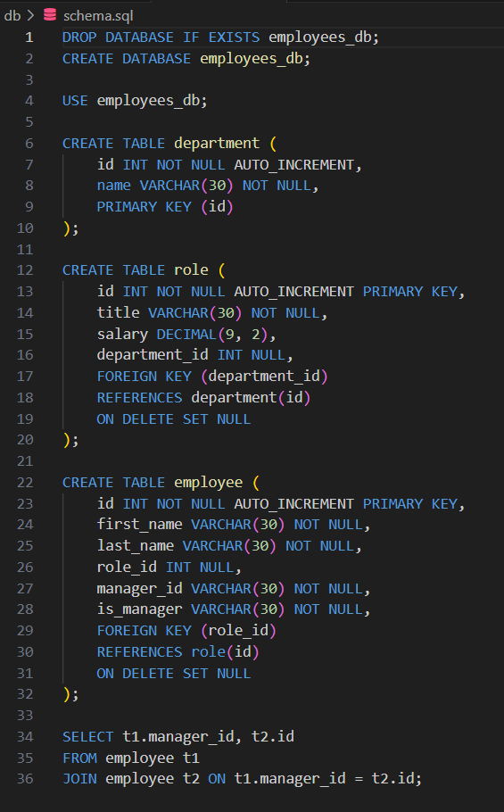
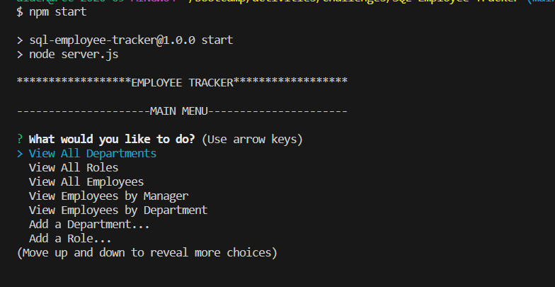
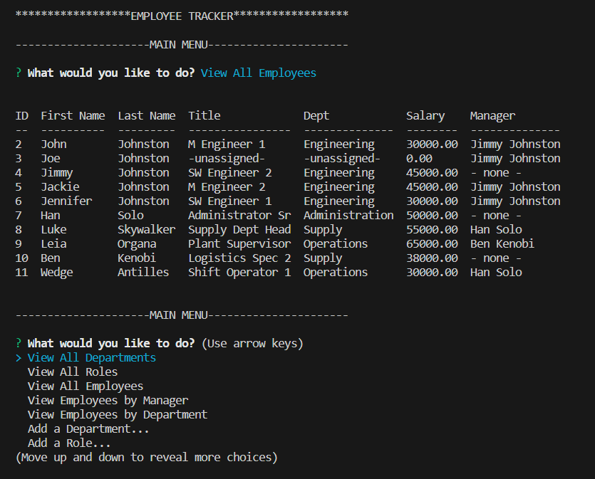
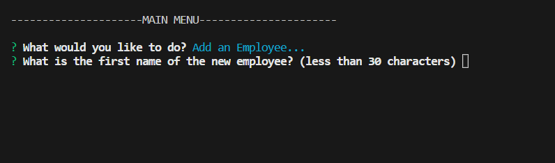
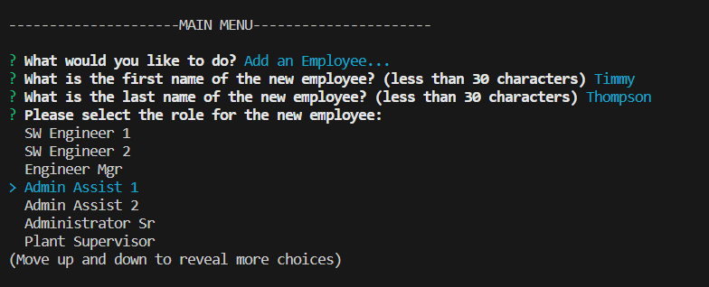
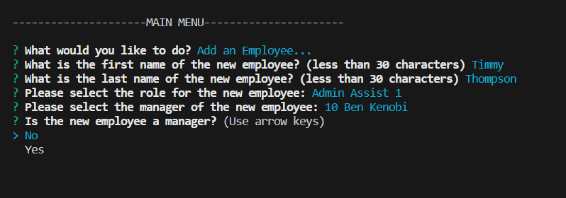
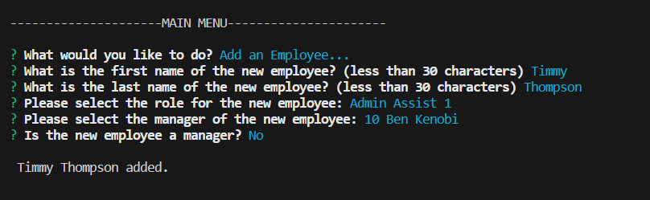
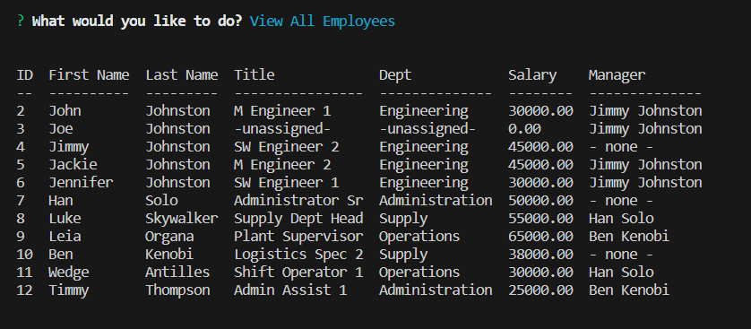

# SQL-Employee-Tracker
This is Rick's SQL Employee Tracker project.

## Description
The purpose of this project is to build a command-line Content Management System (CMS) application that allows non-developers to easily view and interact with employee information stored in a database. This project will utilize Node.js, Inquirer, and MySQL. Acceptance Criteria have been broken down into individual features (e.g. AC01). For details on the implementation, review the applicable 'Usage' section of this README.

### User Story

* AS A business owner
I WANT to be able to view and manage the departments, roles, and employees in my company
SO THAT I can organize and plan my business

### Acceptance Criteria

>* GIVEN a command-line application that accepts user input

>* AC01: Main Menu Options
>    -	WHEN I start the application
>    -	THEN I am presented with the following options: view all departments, view all roles, view all employees, add a department, add a role, add an employee, and update an employee role

>* AC02: Departments Query
>    -	WHEN I choose to view all departments
>    -	THEN I am presented with a formatted table showing department names and department ids

>* AC03: Roles Query
>    -	WHEN I choose to view all roles
>    -	THEN I am presented with the job title, role id, the department that role belongs to, and the salary for that role

>* AC04: Employees Query
>    -	WHEN I choose to view all employees
>    -	THEN I am presented with a formatted table showing employee data, including employee ids, first names, last names, job titles, departments, salaries, and managers that the employees report to

>* AC05: Add Department 
>    -	WHEN I choose to add a department
>    -	THEN I am prompted to enter the name of the department and that department is added to the database

>* AC06: Add Role 
>    -	WHEN I choose to add a role
>    -	THEN I am prompted to enter the name, salary, and department for the role and that role is added to the database

>* AC07: Add Employee 
>    -	WHEN I choose to add an employee
>    -	THEN I am prompted to enter the employee’s first name, last name, role, and manager, and that employee is added to the database

>* AC08: Update Employee Role 
>    -	WHEN I choose to update an employee role
>    -	THEN I am prompted to select an employee to update and their new role and this information is updated in the database

## Installation

> * To watch a video showing the application in use, open the browser and paste the following URL in the address bar, or click on the link: https://watch.screencastify.com/v/V8q7zN1n2WOG6oKefMyZ
> * To access the project repo, open the browser and paste the following URL in the address bar, or click on the link: https://github.com/recenasu/SQL-Employee-Tracker

## Usage

> * From VSCode, open a terminal window
> * Navigate to the project root directory using bash
> * Login into MySQL
> * Type: "use employees_db;" and Press Enter
> * Type: "source ./db/schema.sql" to run the database schema
> * Type: "source ./db/seeds.sql" to seed the database with sample data
> * Click the trash can icon to exit this terminal window
> * Open a new terminal window and navigate to the project root directory using bash
> * Type: "npm start" to launch the application
> * View the Main Menu options (AC01)
> * From the Main Menu, select View All Departments and review the displayed information (AC02)
> * From the Main Menu, select View All Roles and review the displayed information (AC03)
> * From the Main Menu, select View All Employees and review the displayed information (AC04)
> * From the Main Menu, select Add a Department... and follow prompts (AC05)
> * From the Main Menu, select Add a Role... and follow prompts (AC06)
> * From the Main Menu, select Add an Employee... and follow prompts (AC07)
> * From the Main Menu, select Update Employee Role... and follow prompts (AC08)
> * From the Main Menu, try the additional functions: Change Employee Manager, Delete Options, Budget View Options.  

The following images show the database schema, a few sample images of the application, and a sample employee creation sequence.

> * Database Schema

> * Main Menu

> * View All Employees

> * Add An Employee

> * Add An Employee (Continued)

> * Add An Employee (Continued)

> * Add An Employee (Continued)

> * New Employee Added

## Credits

> * npm Inquirer v8.2.6 module was used for the user prompt functionality.
> * npm dotenv v16.3.1 module was used for environment variable security.
> * npm Console.table v0.10.0 module was used for rendering tables in the terminal.
> * npm mysql12 v3.6.0 module was used for connecting to the database for queries.

